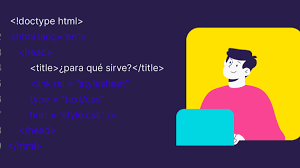

<center>
    
</center>

Lo primero que tiene que hacer un documento HTML es definir su **DOCTYPE**. Para ello la W3C ha definido una serie de tipos de documentos.

La declaración del DOCTYPE tiene que ser la primera línea de nuestro documento HTML.

En el caso de que no indiquemos el DOCTYPE del documento el navegador interpretará el documento como *quirks* o *modo de compatibilidad*. Buscando que el contenido de la página pueda ser visualizado.

Algunos de los tipos de DOCTYPE que define la W3C son:

* HTML 4.01 transitorio
* HTML 4.01 frameset
* HTML Estricto
* HTML5

## HTML 4.01 Estricto

Implica que el documento que se genera tiene que ser compatible con la definición del estándar *HTML 4.01*. Este modo es interpretado correctamente por todos los navegadores y es compatible con el estándar CSS. Además, que conseguiremos tener documentos accesibles.

Aunque no contempla las reglas del estándar XHTML sobre anidación, escritura, es un punto sencillo para hacer una migración hacia XHTML. La cabecera que utilizaremos en este caso será:

```text
<!DOCTYPE html PUBLIC "-//W3C//DTD HTML 4.01 Strict//EN" "http://www.w3.org/TR/html4/strict.dtd">
```

Hay que tener cuidado con el modo estricto ya que algunos navegadores antiguos pueden no interpretar este tipo de documentos.

## HTML 4.01 Transitorio

El nombre de transitorio le viene porque no llega a ser un documento 100% estricto, pero está "en camino" o en transición a conseguirlo. De igual manera que en el modo estricto los elementos deben de ser de la especificación *HTML 4.01*, si bien se permiten elementos que estén obsoletos o deprecados.

La cabecera que utilizaremos en estos casos será:

```text
<!DOCTYPE HTML PUBLIC "-//W3C//DTD HTML 4.01 Transitional//EN" "http://www.w3.org/TR/html4/loose.dtd">
```

## HTML 4.01 Frameset

En el caso de que nuestra página esté compuesta por frames deberemos de utilizar un tipo de DOCTYPE frameset. La cabecera que utilicemos en estos casos será:

```text
<!DOCTYPE HTML PUBLIC "-//W3C//DTD HTML 4.01 Frameset//EN"
"http://www.w3.org/TR/html4/frameset.dtd">
```

## HTML5

En HTML5 han dado un giro a la cabecera ya que han visto que era demasiado compleja para los desarrolladores. Así que lo han reducido a la máxima expresión. La cabecera que utilizaremos en los documentos HTML5 será:

```text
<!DOCTYPE html>
```

Una de las cosas que vemos en este DOCTYPE es que ya no existe una dependencia del DTD del lenguaje. Es importante saber que los documentos HTML tienen la extensión .html o .htm. Es más común la primera de ellas.

## Validando documentos

Una vez que hayamos construido un documento lo mejor que podemos hacer es validarlo. Para ello la W3C nos proporciona un validador en [http://validator.w3.org/](http://validator.w3.org/).

Mediante esta sencilla herramienta podremos validar un documento a partir de una URL de Internet, subiendo un fichero o escribiendo directamente en una caja de texto. Así podremos ver si el documento que hemos generado es compatible con el DOCTYPE que hayamos definido.
