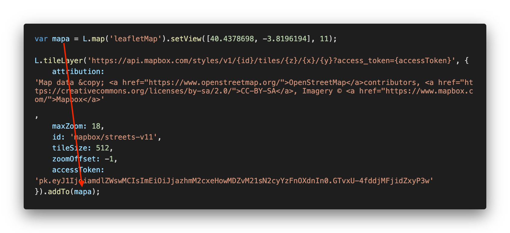

<center>
    
</center>

Los mapas de imágenes nos permiten crear un conjunto de enlaces dentro de una imagen o bien enlazar una parte en concreto de una imagen. Para ello HTML nos ofrece el elemento `map`.

La estructura del elemento map es la siguiente:

```text
<map name="nombreMapa">
  <area/>
  <area/>
  ...
</map>
```

Lo que vemos es que el elemento `map` anida un conjunto de elementos `area`. Los elementos area serán los que establezcan las zonas enlazables dentro de la imagen.

Es importante saber que el mapa en sí no tiene una imagen asociada, si no que tendremos que asociar un elemento `img` al mapa para conseguir tener los áreas enlazables.

## Nombre del Mapa

Una de las cosas más importantes en los mapas de imágenes es darle un nombre. Ya que este nombre será el que enlacemos sobre la imagen para poder usar el mapa de imágenes.

El nombre del mapa de imágenes se da mediante el atributo `name`.

```text
<map name="nombreMapa"></map>
```

## Tipos de Áreas

Dentro de los tipos de áreas que podemos crear dentro de una imagen tenemos diferentes formas:

* `Círculo`, define una región mediante un círculo.
* `Rectángulo`, define la región mediante un rectángulo.
* `Polígono`, define una región mediante un conjunto de puntos que representan un polígono.
* `Por defecto`, sería el resto de zonas no referenciada por ninguna zona.

El elemento area tiene la siguiente estructura:

```text
<area shape="forma" coords="coordenadas" href="enlace" alt="texto alternativo" />
```

Dónde:

* `shape` es la forma a utilizar.
* `coords` el conjunto de coordenadas que define la forma. Dependiendo de la forma utilizada serán unas coordenadas u otras.
* `href` contendrá el enlace y `alt` el texto alternativo a ese enlace.

### Circle

Esta forma define un *área circular* dentro del mapa. En este caso las coordenadas son `x,y` como centro del círculo y radio.

```text
<map>
  <area shape="circle" coords="x,y,radio"/>
</map>
```

### Rect

Representa una forma *rectangular* en el mapa de imágenes. Las coordenadas son `x1,y1` de la esquina superior izquierda seguido de `x2,y2` de la esquina inferior derecha.

```text
<map>
  <area shape="rect" coords="x1,y1,x2,y2"/>
</map>
```

### Poly

Representa una forma de un *polígono* definido por un conjunto de puntos. Las coordenadas son `x1,y1`, `x2, y2`, `x3, y3`, `xN, yN`. Dónde la primer coordenada y la última deben de coincidir para poder cerrar el polígono.

```text
<map>
  <area shape="poly" coords="x1,y1,x2,y2,x3,y3,...,xN,yN"/>
</map>
```

### Default

Representa el resto de zonas del mapa que no hayan sido referenciadas por ninguna forma. En este caso no hay coordenadas.

## Asociar Mapa a Imagen

Lo siguiente que tenemos que hacer es definir la imagen mediante el elemento `img`.

```text

```

Y asociarla el mapa de imágenes. Para ello utilizamos el atributo `usemap` al cual asignaremos el valor indicado en el atributo `name` del mapa.

```text

```

## Ejemplo de Mapa de Imágenes

Para ver el uso de los mapas de imágenes analizaremos el siguiente caso. Vamos a partir de la siguiente imagen y vamos a definir tres mapas. El primero será un área circular sobre el segundo logo, el segundo será un área rectangular sobre el tercer logo y el tercero será un polígono sobre el último logo. En caso de que pinche en otro sitio se irá al enlace del HTML5 que será un área por defecto.

<center>
    
</center>

Así tendremos el siguiente mapa:

```text
<map name="mapalogos">
 <area shape="rect" coords="405,73,520,166" href="#"/>
 <area shape="rect" coords="748,248,750,250" href="#"/>
 <area shape="poly" coords="571,119,626,59,687,118,628,177" href="#"/>
 <area shape="default" href="#"/>
</map>
```

Y el siguiente uso del mapa desde la imagen:

```text

```
