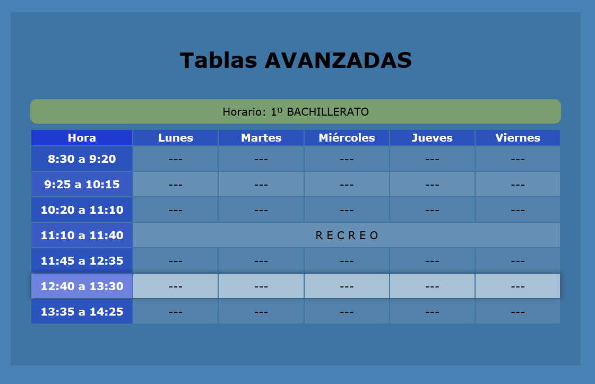

<center>
    
</center>

## Grupos de Filas

Ya hemos visto que las tablas se van definiendo por filas mediante el elemento `tr`. Pues dentro de HTML podemos agrupar estas filas por funcionalidad.

Para ello podemos agrupar las filas en tres partes:

* **Cabecera**, representada por el elemento `thead`.
* **Cuerpo**, representada por el elemento `tbody`.
* **Pie**, representada por el elemento `tfoot`.

Cada uno de estos elementos tendrá *una* o *n* filas, dependiendo de las que queramos agrupar. La estructura es la misma para los tres casos:

```text
<thead>
  <tr> <!-- fila(s) --></tr>
</thead>

<tbody>
  <tr> <!-- fila(s) --></tr>
</tbody>

<tfoot>
  <tr> <!-- fila(s) --></tr>
</tfoot>
```

Es importante saber que no es necesario que aparezcan en ese orden dentro de la tabla, este podría ser alterados. Si bien el navegador si que las representará en dicho orden.

De esta forma podríamos tener la siguiente tabla con agrupaciones:

```text
<table>
  <thead>
    <tr>
	    <td scope="row">Mes</td>
        <td>Enero</td>
        <td>Febrero</td>
    </tr>
  </thead>
  <tfoot>
    <tr>
	    <td>Total</td>
        <td>15</td>
        <td>25</td>
    </tr>
  </tfoot>
  <tbody>
    <tr>
	    <td>Agua</td>
        <td>10</td>
        <td>15</td>
    </tr>
    <tr>
	    <td>Gas</td>
        <td>5</td>
        <td>10</td>
    </tr>
  </tbody>
</table>
```

Que representaría lo siguiente:

<table>
  <thead>
    <tr>
	<td scope="row">Mes</td>
      <td>Enero</td>
      <td>Febrero</td>
    </tr>
  </thead>
  <tfoot>
    <tr>
	<td>Total</td>
      <td>15</td>
      <td>25</td>
    </tr>
  </tfoot>
  <tbody>
    <tr>
	<td>Agua</td>
      <td>10</td>
      <td>15</td>
    </tr>
    <tr>
	<td>Gas</td>
      <td>5</td>
      <td>10</td>
    </tr>
  </tbody>
</table>

## Grupos de columnas

Ya hemos visto que las tablas se definen por filas. Pero una de las cosas que nos ofrece HTML es la posibilidad de definir, sobre dichas filas, grupos de columnas que tengan una relación semántica entre ellas.

Por ejemplo en la siguiente tabla vemos que hay una relación semántica de las columnas relativa a los meses.

```text
<table>
  <colgroup span="2" width="100"></colgroup>
  <colgroup span="2" width="100"></colgroup>
  <tr>
    <td colspan="2">Enero</td>
    <td colspan="2">Febrero</td>
  </tr>
  <tr>
    <td>Ingresos</td>
    <td>Gastos</td>
    <td>Ingresos</td>
    <td>Gastos</td>
  </tr>
  <tr>
    <td>1.000€</td>
    <td>700€/td>
    <td>1.100€</td>
    <td>580€</td>
  </tr>
  <tr>
    <td>1.800€</td>
    <td>920€</td>
    <td>1.750€</td>
    <td>920€</td>
  </tr>
</table>
```

Para poder definir estas relaciones semánticas entre las columnas HTML nos ofrece el elemento `colgroup`.

El elemento colgroup se define al principio de la tabla y tiene la siguiente estructura.

```text
<colgroup span="numero-columnas" width="ancho"></colgroup>
```

Dónde el atributo `span` indica el número de columnas que representa la agrupación. Empezando de izquierda a derecha.

Además contamos con el atributo `width` el cual nos permite especificar un ancho para la columna.

En la tabla que hemos visto el código HTML quedaría de la siguiente forma:

```text
<table>
  <colgroup span="2" width="100"></colgroup>
  <colgroup span="2" width="100"></colgroup>
  <tr>
    <td colspan="2">Enero</td>
    <td colspan="2">Febrero</td>
  </tr>
  <tr>
    <td>Ingresos</td>
    <td>Gastos</td>
    <td>Ingresos</td>
    <td>Gastos</td>
  </tr>
  <tr>
    <td>1.000€</td>
    <td>700€/td>
    <td>1.100€</td>
    <td>580€</td>
  </tr>
  <tr>
    <td>1.800€</td>
    <td>920€</td>
    <td>1.750€</td>
    <td>920€</td>
  </tr>
</table>
```

Si no queremos utilizar el atributo span o si bien queremos manipular los estilos gráficos de las columnas, tenemos otro elemento, este es el elemento `col`.

El elemento col aparecerá dentro del elemento `colgroup` tantas veces como columnas queramos agrupar.

La estructura del elemento col es:

```text
<col span="numero-columnas" width="ancho-columna" />
```

Es decir que también permite agrupar columnas mediante su atributo `width` y darles un ancho mediante el atributo width.

El anterior ejemplo utilizando el elemento col quedaría de la siguiente forma:

```text
<table>
  <colgroup>
    <col width="100">
    <col width="100">
  </colgroup>
  <colgroup>
    <col width="100">
    <col width="100">
  </colgroup>
  <tr>
    <td colspan="2">Enero</td>
    <td colspan="2">Febrero</td>
  </tr>
  <tr>
    <td>Ingresos</td>
    <td>Gastos</td>
    <td>Ingresos</td>
    <td>Gastos</td>
  </tr>
  <tr>
    <td>1.000€</td>
    <td>700€/td>
    <td>1.100€</td>
    <td>580€</td>
  </tr>
  <tr>
    <td>1.800€</td>
    <td>920€</td>
    <td>1.750€</td>
    <td>920€</td>
  </tr>
</table>
```

## Tablas para agentes de usuario no visuales

Las tablas no siempre serán representadas por un navegador web o agente de usuario visual. Hay otro tipo de agentes de usuario que son no visuales y que suelen estar adaptados para discapacitados.

### Asociar celdas a cabeceras

En este sentido tenemos que saber cómo dar formato a las tablas para que estos agentes de usuario no visuales puedan interpretar la información de forma correcta.

El elemento sobre el que nos podemos apoyar es el atributo `header`. El atributo *header* relaciona una celda con una celda de la cabecera, para poder establecer esta relación semántica.

Partamos de la siguiente tabla…

<tr>
  <th headers="nombre">Víctor</th>
  <th headers="edad">38</th>
  <th headers="localidad">Madrid</th>
</tr>
<tr>
  <th headers="nombre">Esther</th>
  <th headers="edad">25</th>
  <th headers="localidad">Salamanca</th>
</tr>

Para ello lo primero que hay que hacer es darle un atributo id a las celdas de cabecera.

```
<tr>
  <th id="nombre">Nombre</th>
  <th id="edad">Edad</th>
  <th id="localidad">Localidad</th>
</tr>
```

Ahora, para cada celda deberemos de asociar el identificador, atributo `id`, de la cabecera que les aplique en el atributo `headers`.

```
<tr>
  <th headers="nombre">Víctor</th>
  <th headers="edad">38</th>
  <th headers="localidad">Madrid</th>
</tr>
<tr>
  <th headers="nombre">Esther</th>
  <th headers="edad">25</th>
  <th headers="localidad">Salamanca</th>
</tr>
```

Así, el agente de usuario no visual, cuando vaya leyendo la fila hará lo siguiente:

```
“Nombre, Víctor. Edad, 38. Localidad, Madrid.
Nombre, Esther. Edad, 25. Localidad, Salamanca."
```

## Categorizar Celdas

Otra de las cosas que podemos hacer para los agentes de usuario no visuales es categorizar las celdas. En HTML tenemos un atributo que es `axis`, de esta manera podemos establecer ejes de agrupación.

El atributo `axis` aplica a las celdas `td` y celdas de cabecera `th`. Y permite darle una categoría textual.

La estructura sería:

```
<td axis="categoria">...</td>
```

<table>
  <tr>
    <th></th>
    <th axis="gasto">Comida</th>
    <th axis="gasto">Hotel</th>
    <th axis="gasto">Transporte</th>
  </tr>
  <tr>
    <td axis="ciudad">Madrid</td>
    <td></td>
    <td></td>
    <td></td>
  </tr>
  <tr>
    <td axis="fecha">1 de marzo</td>
    <td>15</td>
    <td>120</td>
    <td>-</td>
  </tr>
  <tr>
    <td axis="fecha">2 de marzo</td>
    <td>18</td>
    <td>120</td>
    <td>34</td>
  </tr>
  <tr>
    <td axis="fecha">3 de marzo</td>
    <td>25</td>
    <td>120</td>
    <td>-</td>
  </tr>
  <tr>
    <td axis="ciudad">Avila</td>
    <td></td>
    <td></td>
    <td></td>
  </tr>
  <tr>
    <td axis="fecha">4 de marzo</td>
    <td>10</td>
    <td>75</td>
    <td>12</td>
  </tr>
  <tr>
    <td axis="fecha">5 de marzo</td>
    <td>12</td>
    <td>75</td>
    <td>14</td>
  </tr>
</table>

En esta tabla podemos establecer que haya 3 tipos de categorías. Los gastos (comida, hotel y transporte), las ciudades (Madrid y Ávila) y las fechas.

Así que deberemos de marcar esas celdas con la categoría correspondiente, mediante el atributo axis. El código en HTML nos quedará de la siguiente forma:

```
<table>
  <tr>
    <th></th>
    <th axis="gasto">Comida</th>
    <th axis="gasto">Hotel</th>
    <th axis="gasto">Transporte</th>
  </tr>
  <tr>
    <td axis="ciudad">Madrid</td>
    <td></td>
    <td></td>
    <td></td>
  </tr>
  <tr>
    <td axis="fecha">1 de marzo</td>
    <td>15</td>
    <td>120</td>
    <td>-</td>
  </tr>
  <tr>
    <td axis="fecha">2 de marzo</td>
    <td>18</td>
    <td>120</td>
    <td>34</td>
  </tr>
  <tr>
    <td axis="fecha">3 de marzo</td>
    <td>25</td>
    <td>120</td>
    <td>-</td>
  </tr>
  <tr>
    <td axis="ciudad">Avila</td>
    <td></td>
    <td></td>
    <td></td>
  </tr>
  <tr>
    <td axis="fecha">4 de marzo</td>
    <td>10</td>
    <td>75</td>
    <td>12</td>
  </tr>
  <tr>
    <td axis="fecha">5 de marzo</td>
    <td>12</td>
    <td>75</td>
    <td>14</td>
  </tr>
</table>
```

El atributo `axis` se combina con el atributo `headers` para poder dar suficiente información a los agentes de usuario no visuales sobre las tablas.

## Anchos de las tablas y columnas

Aunque el formato de las tablas, tanto para la tabla en sí, como para sus filas y celdas se hará mediante hojas de estilo CSS, tenemos dos formas básicas de poder establecer el ancho de la tabla y el ancho de las columnas.

En primer lugar podemos utilizar el atributo `width` del elemento table.

```
<table width="ancho">...</table>
```

De esta forma podremos establecer en cualquier medida el ancho que queremos que ocupe la tabla. Ya sean `px`, `em`, tantos `por ciento`,…

Por ejemplo podemos definir que ocupe todo el ancho de una página asignándole un valor de width del 100%.

```
<table width="100%">...</table>
```

Para el caso de las columnas ya hemos visto que tanto los elementos `colgroup` como `col` también tenían el atributo `width`. Así que serán con estos elemento con los que de forma básica podamos establecer el ancho de una columna.

De esta forma si tenemos 4 columnas y queremos que se distribuyan de forma igual, podríamos escribir el siguiente código.

```
<table>
  <colgroup span="4" width="25%">
  ....
</table>
```